# FIBO Sample Ontology — Mermaid Visualization

This document renders the FIBO-inspired sample ontology as a Mermaid class diagram.

To preview:
- Open this file in VS Code
- Press Ctrl+Shift+V to open Markdown Preview
- Ensure a Mermaid preview extension is installed (e.g., bierner.markdown-mermaid)

```mermaid
classDiagram
    direction TB
    
    %% PARTIES - Organizations and Individuals
    class Party {
        +partyId: String
        +partyName: String
        +taxIdentificationNumber: String
        +creditScore: Integer
        +riskRating: String
    }
    
    class Organization {
        +legalEntityIdentifier: String
        +incorporationDate: DateTime
    }
    
    class FinancialInstitution
    class Bank
    class InsuranceCompany
    class InvestmentFirm
    class Corporation
    class RegulatoryAuthority
    
    class Individual {
        +dateOfBirth: DateTime
        +nationality: String
    }
    
    class Customer {
        +kycStatus: String
        +customerSince: DateTime
    }
    
    %% Inheritance - Parties
    Party <|-- Organization
    Party <|-- Individual
    Party <|-- Customer
    Organization <|-- FinancialInstitution
    Organization <|-- Corporation
    Organization <|-- RegulatoryAuthority
    FinancialInstitution <|-- Bank
    FinancialInstitution <|-- InsuranceCompany
    FinancialInstitution <|-- InvestmentFirm
    
    %% ACCOUNTS
    class Account {
        +accountNumber: String
        +accountName: String
        +accountStatus: String
        +currentBalance: Double
        +currency: String
        +interestRate: Double
    }
    
    class DepositAccount
    class CheckingAccount
    class SavingsAccount
    class LoanAccount {
        +principalAmount: Double
        +minimumPayment: Double
        +maturityDate: DateTime
    }
    class MortgageAccount
    class CreditCardAccount {
        +creditLimit: Double
    }
    class InvestmentAccount
    class BrokerageAccount
    class RetirementAccount
    
    %% Inheritance - Accounts
    Account <|-- DepositAccount
    Account <|-- LoanAccount
    Account <|-- InvestmentAccount
    DepositAccount <|-- CheckingAccount
    DepositAccount <|-- SavingsAccount
    LoanAccount <|-- MortgageAccount
    LoanAccount <|-- CreditCardAccount
    InvestmentAccount <|-- BrokerageAccount
    InvestmentAccount <|-- RetirementAccount
    
    %% FINANCIAL INSTRUMENTS
    class FinancialInstrument {
        +instrumentId: String
        +instrumentName: String
        +currentPrice: Double
    }
    
    class Security {
        +isin: String
        +cusip: String
    }
    class EquitySecurity {
        +tickerSymbol: String
    }
    class CommonStock
    class PreferredStock
    class DebtSecurity
    class Bond {
        +faceValue: Double
        +couponRate: Double
        +bondMaturityDate: DateTime
    }
    class GovernmentBond
    class CorporateBond
    class MunicipalBond
    
    class Derivative {
        +expirationDate: DateTime
        +notionalAmount: Double
    }
    class Option {
        +strikePrice: Double
    }
    class Future
    class Swap
    
    class Fund {
        +navPerShare: Double
        +assetsUnderManagement: Double
        +expenseRatio: Double
    }
    class MutualFund
    class ETF
    class HedgeFund
    
    %% Inheritance - Instruments
    FinancialInstrument <|-- Security
    FinancialInstrument <|-- Derivative
    FinancialInstrument <|-- Fund
    Security <|-- EquitySecurity
    Security <|-- DebtSecurity
    EquitySecurity <|-- CommonStock
    EquitySecurity <|-- PreferredStock
    DebtSecurity <|-- Bond
    Bond <|-- GovernmentBond
    Bond <|-- CorporateBond
    Bond <|-- MunicipalBond
    Derivative <|-- Option
    Derivative <|-- Future
    Derivative <|-- Swap
    Fund <|-- MutualFund
    Fund <|-- ETF
    Fund <|-- HedgeFund
    
    %% TRANSACTIONS
    class Transaction {
        +transactionId: String
        +transactionDate: DateTime
        +transactionAmount: Double
        +transactionStatus: String
    }
    
    class Payment
    class Transfer
    class Trade {
        +quantity: Double
        +executionPrice: Double
        +commission: Double
    }
    class BuyOrder
    class SellOrder
    class Deposit
    class Withdrawal
    class DividendPayment
    class InterestPayment
    
    %% Inheritance - Transactions
    Transaction <|-- Payment
    Transaction <|-- Transfer
    Transaction <|-- Trade
    Transaction <|-- Deposit
    Transaction <|-- Withdrawal
    Trade <|-- BuyOrder
    Trade <|-- SellOrder
    Payment <|-- DividendPayment
    Payment <|-- InterestPayment
    
    %% CONTRACTS
    class Contract {
        +contractId: String
        +contractName: String
        +effectiveDate: DateTime
        +contractValue: Double
    }
    class LoanAgreement
    class InsurancePolicy {
        +premium: Double
        +coverageAmount: Double
    }
    class ServiceAgreement
    
    Contract <|-- LoanAgreement
    Contract <|-- InsurancePolicy
    Contract <|-- ServiceAgreement
    
    %% RISK
    class Risk {
        +riskId: String
        +riskName: String
        +riskLevel: String
    }
    class CreditRisk {
        +probabilityOfDefault: Double
        +exposureAtDefault: Double
    }
    class MarketRisk {
        +valueAtRisk: Double
    }
    class OperationalRisk
    class LiquidityRisk
    
    Risk <|-- CreditRisk
    Risk <|-- MarketRisk
    Risk <|-- OperationalRisk
    Risk <|-- LiquidityRisk
    
    %% JURISDICTION & COMPLIANCE
    class Jurisdiction {
        +jurisdictionCode: String
        +jurisdictionName: String
    }
    
    class ComplianceRequirement {
        +requirementId: String
        +requirementDescription: String
        +complianceStatus: Boolean
    }
    
    %% RELATIONSHIPS (Object Properties)
    FinancialInstitution "1" --> "*" Customer : hasCustomer
    Organization "1" --> "*" Organization : hasSubsidiary
    FinancialInstitution "*" --> "*" RegulatoryAuthority : regulatedBy
    Party "1" --> "*" Account : hasAccount
    Account "*" --> "1" FinancialInstitution : servicedBy
    InvestmentAccount "*" --> "*" FinancialInstrument : holdsInstrument
    Transaction "*" --> "*" Account : affectsAccount
    Transaction "*" --> "1" Party : initiatedBy
    Trade "*" --> "*" FinancialInstrument : involvesInstrument
    Party "1" --> "*" Contract : hasContract
    Account "*" --> "*" Contract : governedBy
    LoanAccount "*" --> "*" FinancialInstrument : securedBy
    Security "*" --> "1" Organization : issuedBy
    Derivative "*" --> "*" FinancialInstrument : derivedFrom
    Fund "*" --> "1" InvestmentFirm : managedBy
    Party "*" --> "*" Risk : hasRisk
    Account "*" --> "*" Risk : exposedToRisk
    FinancialInstitution "*" --> "*" ComplianceRequirement : subjectToRequirement
    FinancialInstitution "*" --> "*" Jurisdiction : operatesIn
    ComplianceRequirement "*" --> "*" Jurisdiction : appliesIn
```

